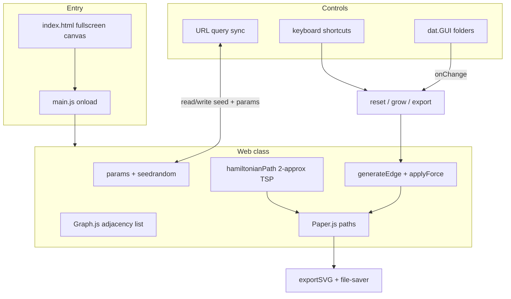

# Spiderweb: Processing-to-Web Port Plan

## Decisions (confirmed)

| Topic | Choice |
|-------|--------|
| Target repo | [`/Users/driescruyskens/Work/code/spiderweb`](file:///Users/driescruyskens/Work/code/spiderweb) (empty — scaffold from scratch) |
| Reference pattern | [`/Users/driescruyskens/Work/code/chrome`](file:///Users/driescruyskens/Work/code/chrome) lifecycle: class-centric art, dat.GUI, Paper.js render, file-saver SVG |
| Build tool | **Vite** (modernized; same architecture as chrome) |
| Canvas | Fullscreen responsive (Paper.js `resize` canvas, 100% viewport) |
| Controls | Hybrid: dat.GUI buttons + keyboard (Space=reset, →=grow, S=export) |
| Debug overlay | dat.GUI toggle, **off by default** (red candidate line + intersection dots) |
| Hamiltonian TSP | Include with dat.GUI toggle |
| Intersection sorting | **Fix** — sort along candidate line parameter `t` (Processing's x-only sort is a known bug on steep lines) |
| Seed | Seeded PRNG + dat.GUI control + **URL query sync** for shareable links |
| SVG export | Chrome-style filename embedding params JSON |
| Growth steps | Configurable `growSteps` and `relaxSteps` in dat.GUI (defaults: 20 / 20) |
| Anchor inset | Scale proportionally (~8% of min(width, height), matching 100/1240 ratio) |
| Deployment | Vercel static (`dist/` output) |
| Branding | Minimal infobox (GitHub + social links), title "Spiderweb" |

---

## Architecture



---

## Source layout

```
spiderweb/
├── index.html              # fullscreen canvas + infobox (from chrome template)
├── package.json            # spiderweb, vite, paper, dat-gui, file-saver, seedrandom
├── vite.config.js
├── vercel.json             # buildCommand + outputDirectory: dist
├── .gitignore
└── src/
    ├── main.js             # window.onload → new Web('paper-canvas')
    ├── Web.js              # main art class (port of Web.pde + tangle_of_webs_2D.pde)
    ├── Graph.js            # replaces JGraphT: vertices, edges, rebuild-on-move
    ├── geometry.js         # lineLine intersection, vec2 helpers, sortAlongLine
    ├── tsp.js              # 2-approx metric TSP (port of JGraphT TwoApproxMetricTSP logic)
    └── urlState.js         # serialize/deserialize params ↔ URLSearchParams
```

---

## Core port: algorithm

Port logic from [`Web.pde`](file:///Users/driescruyskens/Work/code/tangle-of-webs-2D/Web.pde) and [`tangle_of_webs_2D.pde`](file:///Users/driescruyskens/Work/code/tangle-of-webs-2D/tangle_of_webs_2D.pde) with these adaptations:

### 1. Coordinate system (responsive)

- Store vertex positions in **normalized coords** `[0,1]` relative to canvas width/height.
- Convert to pixels on render: `x = nx * viewWidth`, `y = ny * viewHeight`.
- Anchor inset: `margin = 0.08` on each side → corners at `(0.08, 0.08)`, `(0.92, 0.08)`, etc.
- On window resize: redraw existing graph at new pixel size (topology unchanged).

### 2. Graph data structure (`Graph.js`)

Replace JGraphT `DefaultUndirectedGraph<PVector, DefaultEdge>` with a lightweight JS graph:

- Vertices: `{ id, x, y }` with stable numeric IDs (required because positions change each relaxation step — same pattern as Processing's graph rebuild).
- Edges: undirected pairs of vertex IDs.
- Methods mirroring JGraphT usage: `addVertex`, `addEdge`, `removeEdge`, `edgesOf`, `vertexSet`, `edgeSet`, `getOppositeVertex`, `rebuildWithNewPositions(oldToNewMap)`.

### 3. Growth + relaxation (unchanged logic)

- **`generateCandidate()`** — random angle through center, perpendicular offset; use seeded RNG.
- **`generateEdge()`** — find intersections, require ≥2, pick adjacent pair along sorted line parameter, split edges, add new edge.
- **`applyForce()`** — sum normalized neighbor directions for edges longer than `edgeLengthThresh`, move by `forceMultiplier`, rebuild graph (skip anchor vertices).

**Sorting fix:** replace x-only `TreeMap` with sorting intersections by projection parameter `t` onto the candidate line (0→1 along segment).

### 4. Rendering (`Web.js` via Paper.js)

Match Processing visuals:

- Background: `#071013`
- Web lines: `#b1ede8`, strokeWeight 2, round caps/joins
- Debug (when toggled): red candidate line + red intersection dots; **hidden during SVG export**
- Hamiltonian (when toggled): smooth curve through TSP tour vertices

Use Paper.js `Path` for lines; call `paper.view.draw()` after each grow/reset (no continuous animation loop unless user holds grow — keep it step-based like Processing).

### 5. Hamiltonian TSP (`tsp.js`)

Port the disabled Processing feature using a **2-approximation metric TSP**:

- Build complete graph on all current vertices (edge weight = Euclidean distance).
- Run MST-based 2-approx tour (same algorithm family as JGraphT `TwoApproxMetricTSP`).
- Return ordered vertex list for `curveVertex` rendering.

No heavy dependency needed — ~80 lines, self-contained.

### 6. Seeded randomness (`seedrandom`)

- `params.seed` drives all `random()` calls via seeded PRNG instance.
- Initial seed: from URL if present, else random.
- Changing seed in GUI → re-seed RNG → reset graph.

### 7. URL state sync (`urlState.js`)

Encode shareable state in query string, e.g.:

```
?seed=42&forceMultiplier=0.05&edgeLengthThresh=30&growSteps=20&relaxSteps=20&debug=false&hamiltonian=false
```

- **On load:** parse URL → apply to params → reset.
- **On param change:** update URL via `history.replaceState` (no page reload).
- Keep URL reasonably short; omit defaults where possible.

---

## UI (dat.GUI)

Folders modeled after [`Cloth.js`](file:///Users/driescruyskens/Work/code/chrome/src/Cloth.js):

| Folder | Controls |
|--------|----------|
| **Actions** | Reset, Grow (calls N×generateEdge + M×applyForce), Export SVG, Randomize seed |
| **Physics** | `forceMultiplier` (0–2), `edgeLengthThresh` (0–1000) |
| **Growth** | `growSteps` (1–100), `relaxSteps` (1–100) |
| **Display** | `showDebug` toggle, `drawHamiltonian` toggle |
| **Seed** | `seed` slider/input |

All param changes trigger re-render; Reset/Grow trigger algorithm steps.

**Keyboard (hybrid):**

| Key | Action |
|-----|--------|
| Space | Reset |
| → (Right Arrow) | Grow one batch |
| S | Export SVG |

---

## SVG export

Follow chrome pattern from [`Cloth.js`](file:///Users/driescruyskens/Work/code/chrome/src/Cloth.js):

```javascript
const svg = paper.project.exportSVG({ asString: true });
saveAs(blob, 'spiderweb' + JSON.stringify(this.params) + '.svg');
```

During export: temporarily hide debug overlay, export, restore.

---

## Build & deploy

**Dependencies:** `paper`, `dat-gui`, `file-saver`, `seedrandom` (dev: `vite`)

**Scripts:**
- `npm run dev` — Vite dev server
- `npm run build` — Vite production build → `dist/`
- `npm run preview` — local preview of build

**Vercel** ([`vercel.json`](file:///Users/driescruyskens/Work/code/spiderweb/vercel.json)):
```json
{ "buildCommand": "npm run build", "outputDirectory": "dist" }
```

**HTML/CSS:** clone chrome's fullscreen canvas + infobox pattern from [`index.html`](file:///Users/driescruyskens/Work/code/chrome/src/index.html); update title, GitHub link to spiderweb repo, keep Instagram link if desired.

---

## What we are NOT doing (v1 scope)

- No backend / server-side render
- No PNG/raster export
- No auto-grow animation loop (step-based only, like Processing)
- No migration of Processing `controlP5` sliders (replaced by dat.GUI)
- No changes to the original Processing repo

---

## Verification checklist

1. `npm run dev` — page loads fullscreen dark canvas with initial rectangle + one growth step
2. Press → / Grow button — web accumulates mint lines over multiple presses
3. Sliders change relaxation behavior visibly
4. Debug toggle shows/hides red candidate + intersection dots
5. Hamiltonian toggle draws smooth tour overlay
6. S / Export — downloads SVG without debug elements; filename contains params JSON
7. Change seed → different growth pattern; copy URL → paste in new tab → same pattern
8. Resize window — graph scales, no distortion
9. `npm run build` + Vercel deploy — static site works
